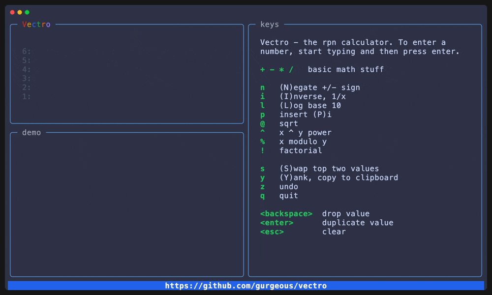

# Vectro
The rpn calculator for your terminal.


## Screenshot



## What is this?


Vectro is an [rpn](https://en.wikipedia.org/wiki/Reverse_Polish_notation) calculator for your terminal. Many people consider rpn easier and faster than traditional calculators. Vectro is written in Go using the excellent [Bubble Tea](https://github.com/charmbracelet/bubbletea) package and distributed as a single executable.

## Installation

On MacOS:

```
$ brew install gurgeous/tap/vectro
```

Or for Linux, [download the latest release](https://github.com/gurgeous/vectro/releases/latest).

Then run vectro like this:

```
$ vectro
```

## Features

- Responsive, works with many terminal sizes
- Stack is saved across sessions
- Niceties like Paste (yank) and Undo, error messages, etc.

## Future Work
- animate when stack changes
- base - (b)base (2/8/10/16) (& - and, | - or, < > for shifting)
- deg, rad, trig
- advanced calculations (autocomplete, shift-ctrl-p)
- theming
